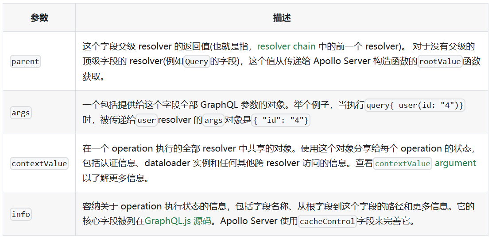

# @apollo/server

## 基于KOA 上的安装
> @akjs/core 已经初步集成的graphql服务。
> dependents: `@apollo/server`, `@as-integrations/koa`, `graphql`

```ts
// GraphQL
import { ApolloServer, ApolloServerOptions } from '@apollo/server'
import { ApolloServerPluginDrainHttpServer } from '@apollo/server/plugin/drainHttpServer'
import { koaMiddleware } from '@as-integrations/koa'

const graphServer = new ApolloServer({
    plugins: [ApolloServerPluginDrainHttpServer({ httpServer: this.server })],
    // logger: this.logger,
    ...this.config.apolloConfig,
})

graphServer.start().then((res) => {
    app.use(koaMiddleware(graphServer))
    console.log('GraphQL start in: ' + chalk.green('[post] /graphgl'))
}).catch(err => {
    console.error('graph start error:', err)
})
```

## resolvers 参数定义



```ts
export const resolver = {
    Query: {
        name: () => 'name',
        desc: (parent, args, cntextValue, info) => {
            return ''
        }
    }
}
```