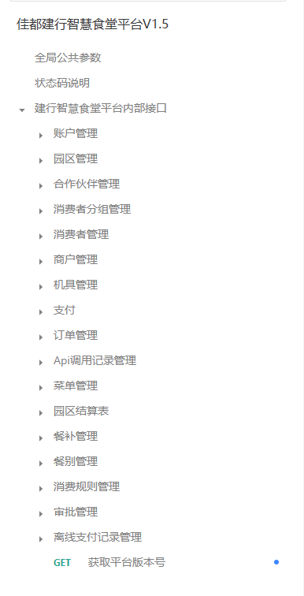

2022-06-22 ~ 2023-04 pci-商用部门

2022-06-22 ~ 08-22
`广州健康驿站-H5人脸机` 为定制安卓人脸设备开发前端交互应用。运行于 webview；

`face3.0 人脸管理后台`
针对 楼宇人脸机 进行管理，其中包括 人脸登记、授权，人脸下发。记录查阅，访客预约等功能。
基于 vue2 浏览器、公众号挂载的 h5 页面；

`朗国x2500鸿蒙机人脸机demo` 开发：
首次接触鸿蒙 hap 开发，经过数月的开发、实践。在对鸿蒙 hap 还处于较为浅薄的情况下，发表一下自己的个人感想，以下内容仅代表个人看法。仅供参考，如有不当之处,请予指正。

1. X2500 在兼容轻量级 openHarmony 的类 Web 开发语法上，是完整、稳定的，满足轻量应用的开发需求
2. 采用 JS 编程，降低学习开发的成本，容易上手。也正符合鸿蒙系统采用 ets 逐步取代 java 编程的趋势
3. 存在一些开发上的误导现象，eg：JS 模块化在语法上采用 ESM 规范，其中 ESM 规范是值的动态映射，但具体使用中，则和 cjs 的值拷贝类似。
4. 缺少真机调试的有效手段
5. 目前的 x2500 在应用层面上的开发，未体现出 openHarmony 系统的独特能力，在页面开发能力上有一定的局限性

`acs-device-manage` 地铁门禁管理系统
table，form 等万金油基础组件开发；router、permission 等

`edge-box-manage` 边缘小站 - 盒子管理系统

`视频云平台`

`交通管理助手 - 大模型问答界面`

\\ 杂七杂八定制啊外包项目开发；
